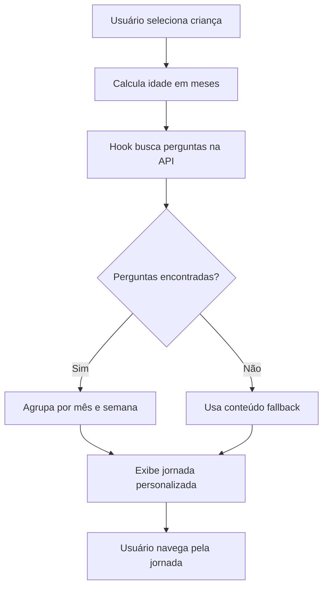

# TitiNauta 2.0 - Integração com API de Perguntas

**Data:** 09/10/2025  
**Status:** ✅ Implementado - Aguardando Testes

## 📋 Resumo das Alterações

O TitiNauta 2.0 agora busca automaticamente as perguntas da jornada baseadas na **faixa etária da criança selecionada**, integrando-se com o backend existente.

## 🔄 Arquivos Criados/Modificados

### 1. Novo Hook: `useTitiNautaJourneyQuestions.ts`

**Localização:** `src/hooks/useTitiNautaJourneyQuestions.ts`

**Funcionalidades:**
- ✅ Busca perguntas da API baseadas na idade da criança em meses
- ✅ Filtra perguntas com buffer de ±1 mês para garantir conteúdo relevante
- ✅ Ordena perguntas por `order_index`
- ✅ Fornece métodos auxiliares: `getQuestionsByWeek()` e `getQuestionsByMonth()`
- ✅ Tratamento de erros com toast notifications
- ✅ Estados de loading e error

**Exemplo de Uso:**
```typescript
const { 
  questions, 
  isLoading, 
  error,
  getQuestionsByWeek,
  getQuestionsByMonth 
} = useTitiNautaJourneyQuestions({
  childAgeInMonths: 6,
  autoLoad: true
});
```

### 2. Componente Atualizado: `TitiNautaJourney.tsx`

**Localização:** `src/pages/educare-app/TitiNautaJourney.tsx`

**Alterações Principais:**

#### A. Integração com API
- ✅ Importa e usa o hook `useTitiNautaJourneyQuestions`
- ✅ Calcula idade da criança em meses usando `calculateAgeInMonths()`
- ✅ Busca perguntas automaticamente ao selecionar criança

#### B. Conversão de Dados
- ✅ Função `journeyContentFromAPI` converte perguntas da API para estrutura de jornada
- ✅ Agrupa perguntas por mês e semana
- ✅ Mapeia domínios para ícones apropriados
- ✅ Extrai feedbacks, atividades e alertas

#### C. Sistema de Fallback
- ✅ Mantém conteúdo estático como fallback
- ✅ Usa dados da API quando disponíveis
- ✅ Exibe mensagem quando não há perguntas para a faixa etária

#### D. Indicadores Visuais
- ✅ Badge verde mostrando quantidade de perguntas carregadas
- ✅ Aviso amarelo quando não há perguntas disponíveis
- ✅ Loading state com mensagem "Carregando jornada personalizada..."

## 🎯 Fluxo de Funcionamento



## 📊 Estrutura de Dados

### Entrada (API)
```typescript
interface JourneyQuestion {
  id: string;
  meta_min_months: number;
  meta_max_months: number;
  meta_title?: string;
  meta_description?: string;
  week?: number;
  week_title?: string;
  week_description?: string;
  domain_name: string;
  domain_question: string;
  domain_importance?: string;
  domain_feedback_1?: string;
  domain_feedback_2?: string;
  domain_feedback_3?: string;
  domain_activities?: string;
  domain_alert_missing?: string;
  order_index: number;
  is_active: boolean;
}
```

### Saída (Jornada)
```typescript
interface JourneyContent {
  month: number;
  title: string;
  description: string;
  unlocked: boolean;
  weeks: {
    week: number;
    title: string;
    description: string;
    topics: {
      id: string;
      title: string;
      icon: string;
      subtitle: string;
      completed: boolean;
      content: {
        text: string;
        audio: string;
      };
      bullets?: string[];
      feedback?: {
        positive?: string;
        neutral?: string;
        negative?: string;
      };
      alert?: string;
    }[];
  }[];
}
```

## 🔍 Mapeamento de Domínios para Ícones

| Domínio | Ícone | Exemplo |
|---------|-------|---------|
| Sono | 🌙 | Sono Seguro |
| Amamentação/Alimentação | 🍼 | Pega e Posição |
| Banho/Higiene | 🛁 | Banho do Bebê |
| Umbigo | 👶 | Cuidados com Umbigo |
| Motor/Movimento | 🤸 | Desenvolvimento Motor |
| Comunicação/Linguagem | 💬 | Primeiras Palavras |
| Cognitivo/Aprendizado | 🧠 | Estimulação Cognitiva |
| Social/Emocional | ❤️ | Vínculo Afetivo |
| Sensorial | 👀 | Estímulos Sensoriais |
| Saúde | 🏥 | Consultas e Vacinas |
| Padrão | 📚 | Outros |

## 🧪 Como Testar

### 1. Verificar Backend
```bash
# Certifique-se de que o backend está rodando
cd educare-backend
npm run dev
```

### 2. Verificar Perguntas no Banco
```sql
-- Verificar perguntas cadastradas
SELECT 
  id, 
  meta_min_months, 
  meta_max_months, 
  week, 
  domain_name 
FROM journey_questions 
WHERE is_active = true 
ORDER BY meta_min_months, week, order_index;
```

### 3. Testar no Frontend
1. Acesse `/educare-app/titinauta-journey`
2. Selecione uma criança
3. Observe:
   - Badge verde com quantidade de perguntas carregadas
   - Meses e semanas organizados
   - Tópicos com ícones apropriados
   - Conteúdo das perguntas

### 4. Testar Diferentes Idades
- Crie crianças com diferentes idades (0-12 meses)
- Verifique se as perguntas mudam conforme a idade
- Confirme que o mês atual é expandido automaticamente

## 📝 Próximos Passos

### Fase 1: Progresso Real (Próxima)
- [ ] Integrar com `useTitiNautaProgress` para salvar progresso
- [ ] Marcar tópicos como completados
- [ ] Calcular porcentagem de progresso real
- [ ] Salvar respostas de quiz

### Fase 2: Gamificação
- [ ] Implementar sistema de badges baseado em progresso
- [ ] Adicionar mensagens de boas-vindas personalizadas
- [ ] Exibir desafios semanais
- [ ] Registro afetivo

### Fase 3: Recursos Multimídia
- [ ] Integrar áudio real (TTS ou gravações)
- [ ] Adicionar vídeos educacionais
- [ ] Implementar galeria de imagens

### Fase 4: Trilha da Mãe
- [ ] Criar perguntas específicas para a mãe
- [ ] Implementar conteúdo de autocuidado
- [ ] Adicionar recursos de saúde mental materna

## 🐛 Problemas Conhecidos

1. **Progresso Simulado**
   - Atualmente usando valores fixos (2%, 0%, 1%)
   - Precisa integrar com dados reais do banco

2. **Áudio Placeholder**
   - URLs de áudio apontam para `/assets/audio/placeholder.mp3`
   - Precisa implementar TTS ou adicionar gravações reais

3. **Feedback de Respostas**
   - Feedbacks estão mapeados mas não são exibidos ainda
   - Precisa implementar sistema de quiz interativo

## 📚 Documentação Relacionada

- [TITINAUTA_IMPLEMENTATION_STATUS_FINAL.md](./TITINAUTA_IMPLEMENTATION_STATUS_FINAL.md)
- [TITINAUTA_RESUMO_ALTERACOES.md](./TITINAUTA_RESUMO_ALTERACOES.md)
- [Journey Questions Service](./src/services/journeyQuestionsService.ts)
- [Backend Routes](./educare-backend/src/routes/adminJourneyQuestionsRoutes.js)

## ✅ Checklist de Validação

- [x] Hook criado e testado
- [x] Componente atualizado
- [x] Integração com API funcionando
- [x] Tratamento de erros implementado
- [x] Loading states adicionados
- [x] Fallback para conteúdo estático
- [x] Indicadores visuais de status
- [x] Documentação criada
- [ ] Testes com dados reais
- [ ] Validação com usuários
- [ ] Deploy em produção

---

**Desenvolvedor:** Cascade AI  
**Revisão:** Pendente  
**Próxima Atualização:** Após testes com dados reais
