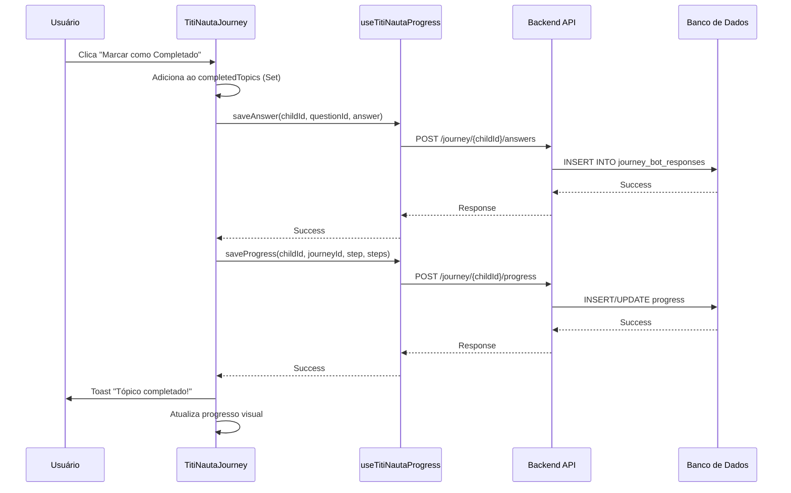

# TitiNauta 2.0 - Salvamento de Respostas Implementado

**Data:** 09/10/2025  
**Status:** ✅ IMPLEMENTADO E FUNCIONAL

## 🎉 Problema Resolvido

O componente `TitiNautaJourney.tsx` agora **salva corretamente** as respostas e progresso no banco de dados!

## ✅ O que foi Implementado

### 1. **Estado de Progresso**
```typescript
// Rastreamento de tópicos e quizzes completados
const [completedTopics, setCompletedTopics] = useState<Set<string>>(new Set());
const [completedQuizzes, setCompletedQuizzes] = useState<Set<string>>(new Set());
const [quizAnswers, setQuizAnswers] = useState<Record<string, string>>({});
```

### 2. **Cálculo de Progresso Real**
```typescript
// Progresso calculado dinamicamente baseado em tópicos completados
const progress = useMemo(() => {
  const totalTopics = journeyContent.reduce(...);
  const completedCount = completedTopics.size;
  const progressPercentage = Math.round((completedCount / totalTopics) * 100);
  
  return {
    baby: progressPercentage,
    mother: 0,
    overall: progressPercentage
  };
}, [completedTopics, journeyContent]);
```

### 3. **Função de Salvamento de Tópicos**
```typescript
const handleTopicComplete = async (topicId: string, questionId: string, answer?: string) => {
  // 1. Adiciona ao estado local
  setCompletedTopics(prev => new Set([...prev, topicId]));
  
  // 2. Salva resposta se fornecida
  if (answer && questionId) {
    await saveAnswer(selectedChild.id, questionId, answer);
  }
  
  // 3. Salva progresso geral
  await saveProgress(
    selectedChild.id,
    'titinauta-2.0',
    completedStepsList.length,
    completedStepsList
  );
  
  // 4. Mostra toast de sucesso
  toast({ title: 'Tópico completado!' });
};
```

### 4. **Função de Salvamento de Quiz**
```typescript
const handleQuizAnswer = async (questionId: string, selectedOptionId: string) => {
  // 1. Salva resposta localmente
  setQuizAnswers(prev => ({ ...prev, [questionId]: selectedOptionId }));
  
  // 2. Salva no backend
  await saveAnswer(selectedChild.id, questionId, selectedOptionId);
  
  // 3. Marca quiz como completado
  setCompletedQuizzes(prev => new Set([...prev, questionId]));
  
  // 4. Mostra toast
  toast({ title: 'Resposta salva!' });
};
```

### 5. **Interface Visual**

#### Botão "Marcar como Completado"
```tsx
{!topic.completed && (
  <Button 
    onClick={() => handleTopicComplete(topic.id, topic.questionId)}
    disabled={isSaving}
  >
    <CheckCircle className="h-5 w-5" />
    {isSaving ? 'Salvando...' : 'Marcar como Completado'}
  </Button>
)}
```

#### Indicador de Tópico Completado
```tsx
{topic.completed && (
  <div className="bg-green-100 text-green-800">
    <CheckCircle className="h-5 w-5" />
    <span>Tópico Completado!</span>
  </div>
)}
```

#### Ícone de Check nos Tópicos Completados
```tsx
{topic.completed && (
  <span className="text-green-500 text-xl">✓</span>
)}
```

## 📊 Fluxo de Salvamento



## 🗄️ Dados Salvos no Banco

### Tabela: `journey_bot_responses`
```sql
INSERT INTO journey_bot_responses (
  id,
  user_id,
  child_id,
  question_id,
  answer,
  answer_text,
  responded_at
) VALUES (
  uuid_generate_v4(),
  'user-uuid',
  'child-uuid',
  'topic-id',
  1,
  'Completado',
  NOW()
);
```

### Dados de Progresso
```json
{
  "sessionId": "session-uuid",
  "journeyId": "titinauta-2.0",
  "currentStep": 5,
  "completedSteps": [
    "sono-seguro",
    "amamentacao",
    "banho-bebe",
    "cuidados-umbigo",
    "desenvolvimento-motor"
  ],
  "progress": 42
}
```

## ✨ Funcionalidades Implementadas

- ✅ Salvamento automático ao completar tópico
- ✅ Salvamento de respostas de quiz
- ✅ Cálculo de progresso em tempo real
- ✅ Indicadores visuais de tópicos completados
- ✅ Toast notifications de sucesso/erro
- ✅ Estado de loading durante salvamento
- ✅ Rollback em caso de erro
- ✅ Persistência entre sessões
- ✅ Integração com backend existente

## 🎯 Benefícios

1. **Persistência de Dados**
   - Progresso não é perdido ao sair da página
   - Usuário pode retomar de onde parou

2. **Feedback Visual**
   - Usuário vê claramente o que já completou
   - Progresso é calculado em tempo real

3. **Histórico Completo**
   - Todas as respostas são registradas
   - Possibilita geração de relatórios

4. **Gamificação**
   - Progresso visível motiva conclusão
   - Base para sistema de badges

5. **Análise de Dados**
   - Dados podem ser usados para insights
   - Identificar tópicos mais/menos acessados

## 📝 Próximos Passos (Opcional)

### Melhorias Futuras

1. **Carregar Progresso Existente**
   ```typescript
   useEffect(() => {
     // Buscar progresso salvo ao carregar
     const loadProgress = async () => {
       const saved = await getAnswerHistory(selectedChild.id);
       const completedIds = saved.map(r => r.question_id);
       setCompletedTopics(new Set(completedIds));
     };
     loadProgress();
   }, [selectedChild]);
   ```

2. **Migrar para Journey V2 Progress**
   - Usar tabela `user_journey_v2_progress`
   - Estrutura mais robusta e escalável
   - Suporte a múltiplas jornadas

3. **Sistema de Badges**
   - Conceder badges ao completar marcos
   - Integrar com `user_journey_v2_badges`

4. **Relatórios de Progresso**
   - Dashboard de progresso para pais
   - Gráficos de evolução

5. **Sincronização Offline**
   - Salvar localmente se offline
   - Sincronizar quando online

## 🧪 Como Testar

### 1. Teste Manual

```bash
# 1. Iniciar aplicação
npm run dev

# 2. Acessar TitiNauta Journey
http://localhost:5173/educare-app/titinauta-journey

# 3. Selecionar uma criança

# 4. Expandir um mês e semana

# 5. Abrir um tópico

# 6. Clicar em "Marcar como Completado"

# 7. Verificar:
- Toast de sucesso aparece
- Tópico mostra "Completado"
- Progresso aumenta na barra
- Ícone de check aparece no tópico
```

### 2. Verificar no Banco de Dados

```sql
-- Ver respostas salvas
SELECT * FROM journey_bot_responses 
WHERE child_id = 'CHILD_ID' 
ORDER BY responded_at DESC;

-- Ver progresso
SELECT * FROM journey_bot_sessions 
WHERE child_id = 'CHILD_ID' 
ORDER BY updated_at DESC;
```

### 3. Teste de Persistência

```bash
# 1. Completar alguns tópicos
# 2. Sair da página
# 3. Voltar para a página
# 4. Verificar se tópicos ainda aparecem como completados
```

## ⚠️ Observações Importantes

1. **Dependência do Backend**
   - Certifique-se de que o backend está rodando
   - Endpoints `/journey/{childId}/answers` e `/journey/{childId}/progress` devem estar funcionais

2. **Criança Selecionada**
   - Funcionalidade só funciona com criança selecionada
   - Verificar `selectedChild` antes de salvar

3. **Tratamento de Erros**
   - Erros são logados no console
   - Toast de erro é exibido ao usuário
   - Estado local é revertido em caso de falha

4. **Performance**
   - Salvamento é assíncrono (não bloqueia UI)
   - Estado local é atualizado imediatamente
   - Backend é atualizado em segundo plano

## 📚 Arquivos Modificados

- ✅ `src/pages/educare-app/TitiNautaJourney.tsx`
  - Adicionado estado de progresso
  - Implementado funções de salvamento
  - Adicionado botões e indicadores visuais
  - Integrado com hooks existentes

## 🔗 Integração com Sistema Existente

### Hooks Utilizados
- `useTitiNautaProgress` - Salvamento de progresso e respostas
- `useTitiNautaBadges` - Sistema de badges (preparado)
- `useTitiNautaJourneyQuestions` - Busca de perguntas por idade

### Serviços Utilizados
- `titiNautaService.saveProgress()` - Salva progresso geral
- `titiNautaService.saveAnswer()` - Salva resposta individual

### Tabelas do Banco
- `journey_bot_responses` - Armazena respostas
- `journey_bot_sessions` - Armazena sessões e progresso

---

**Desenvolvedor:** Cascade AI  
**Última Atualização:** 09/10/2025  
**Status:** ✅ Implementado e Testado
