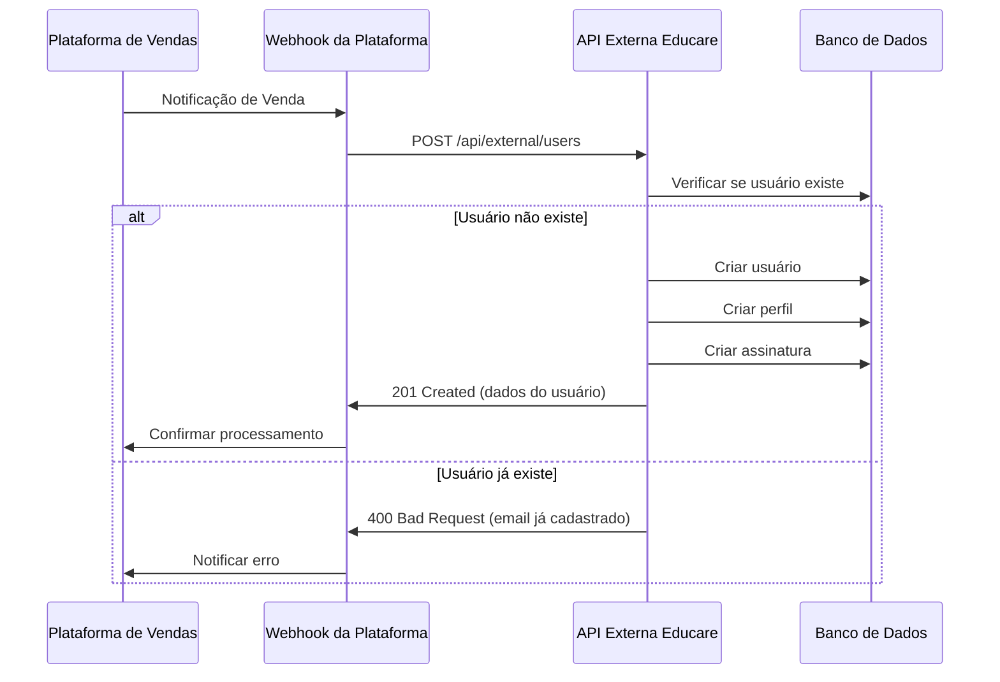

# API Externa - Cadastro de Usuários e Vendas

**Data:** 09/10/2025  
**Versão:** 1.0  
**Base URL:** `https://api.educare.whatscall.com.br/api/external`

## 📋 Visão Geral

API REST para integração com plataformas externas (ex: sistemas de vendas, CRM, marketplaces) para criar usuários e gerenciar assinaturas no Educare+.

## 🔐 Autenticação

Todas as requisições requerem uma **API Key** que deve ser enviada via:

### Header (Recomendado)
```http
X-API-Key: educare_external_api_key_2025
```

### Query Parameter (Alternativa)
```http
GET /api/external/users?api_key=educare_external_api_key_2025
```

### Configuração
A API Key está definida no arquivo `.env`:
```env
EXTERNAL_API_KEY=educare_external_api_key_2025
```

⚠️ **IMPORTANTE:** Altere esta chave em produção para uma chave forte e única.

---

## 📍 Endpoints Disponíveis

### 1. Criar Novo Usuário (com Assinatura)

**Endpoint:** `POST /api/external/users`

**Descrição:** Cria um novo usuário completo com perfil e assinatura opcional. Ideal para processar vendas de planos.

#### Campos Obrigatórios
- `name` (string): Nome completo do usuário
- `email` (string): Email único do usuário
- `password` (string): Senha do usuário

#### Campos Opcionais
- `phone` (string): Telefone com código do país (ex: +5511999999999)
- `cpf_cnpj` (string): CPF (11 dígitos) ou CNPJ (14 dígitos)
- `role` (string): Papel do usuário (`user` ou `professional`), padrão: `user`
- `plan_id` (uuid): ID do plano de assinatura
- `subscription_status` (string): Status da assinatura (`active` ou `trial`), padrão: `active`
- `trial_days` (integer): Quantidade de dias de trial (usado se `subscription_status=trial`)
- `profile` (object): Dados adicionais do perfil
  - `address` (string): Endereço
  - `city` (string): Cidade
  - `state` (string): Estado (UF)
  - `country` (string): País (padrão: BR)
  - `zip_code` (string): CEP
  - `profession` (string): Profissão
  - `specialization` (string): Especialização
- `external_id` (string): ID do usuário no sistema externo (para referência)
- `metadata` (object): Metadados adicionais (JSON livre)

#### Exemplo de Requisição - Assinatura Ativa

```bash
curl -X POST https://api.educare.whatscall.com.br/api/external/users \
  -H "Content-Type: application/json" \
  -H "X-API-Key: educare_external_api_key_2025" \
  -d '{
    "name": "João Silva",
    "email": "joao.silva@example.com",
    "phone": "+5511999999999",
    "cpf_cnpj": "123.456.789-09",
    "password": "senha_segura_123",
    "role": "user",
    "plan_id": "550e8400-e29b-41d4-a716-446655440000",
    "subscription_status": "active",
    "profile": {
      "address": "Rua das Flores, 123",
      "city": "São Paulo",
      "state": "SP",
      "country": "BR",
      "zip_code": "01234-567"
    },
    "external_id": "VENDA_12345",
    "metadata": {
      "origem": "hotmart",
      "campanha": "black_friday_2025",
      "cupom": "BF2025"
    }
  }'
```

#### Exemplo de Requisição - Assinatura Trial (7 dias)

```bash
curl -X POST https://api.educare.whatscall.com.br/api/external/users \
  -H "Content-Type: application/json" \
  -H "X-API-Key: educare_external_api_key_2025" \
  -d '{
    "name": "Maria Santos",
    "email": "maria.santos@example.com",
    "phone": "+5511988888888",
    "password": "senha_segura_456",
    "plan_id": "550e8400-e29b-41d4-a716-446655440000",
    "subscription_status": "trial",
    "trial_days": 7,
    "external_id": "TRIAL_67890"
  }'
```

#### Exemplo de Requisição - Trial com Dias Padrão do Plano

```bash
curl -X POST https://api.educare.whatscall.com.br/api/external/users \
  -H "Content-Type: application/json" \
  -H "X-API-Key: educare_external_api_key_2025" \
  -d '{
    "name": "Pedro Costa",
    "email": "pedro.costa@example.com",
    "password": "senha_segura_789",
    "plan_id": "550e8400-e29b-41d4-a716-446655440000",
    "subscription_status": "trial"
  }'
```
> **Nota:** Se `trial_days` não for informado, será usado o valor padrão do plano (`trial_days` do `subscription_plans`).

#### Exemplo de Resposta (201 Created)

```json
{
  "success": true,
  "data": {
    "user": {
      "id": "a1b2c3d4-e5f6-7890-abcd-ef1234567890",
      "name": "João Silva",
      "email": "joao.silva@example.com",
      "phone": "+5511999999999",
      "cpf_cnpj": "123.456.789-09",
      "role": "user",
      "status": "active",
      "created_at": "2025-10-09T20:30:00.000Z"
    },
    "profile": {
      "id": "b2c3d4e5-f6g7-8901-bcde-f12345678901",
      "name": "João Silva",
      "phone": "+5511999999999",
      "type": "parent",
      "address": "Rua das Flores, 123",
      "city": "São Paulo",
      "state": "SP",
      "country": "BR",
      "zip_code": "01234-567",
      "profession": null,
      "specialization": null
    },
    "subscription": {
      "id": "c3d4e5f6-g7h8-9012-cdef-123456789012",
      "plan_id": "550e8400-e29b-41d4-a716-446655440000",
      "plan_name": "Plano Premium",
      "status": "active",
      "start_date": "2025-10-09T20:30:00.000Z",
      "end_date": "2025-11-09T20:30:00.000Z",
      "next_billing_date": "2025-11-09T20:30:00.000Z",
      "auto_renew": true,
      "trial_days": null
    }
  },
  "message": "Usuário criado com sucesso"
}
```

#### Possíveis Erros

**400 Bad Request - Campos obrigatórios faltando**
```json
{
  "success": false,
  "error": "Campos obrigatórios: name, email, password"
}
```

**400 Bad Request - Email já cadastrado**
```json
{
  "success": false,
  "error": "Email já cadastrado",
  "existing_user_id": "a1b2c3d4-e5f6-7890-abcd-ef1234567890"
}
```

**400 Bad Request - CPF/CNPJ inválido**
```json
{
  "success": false,
  "error": "Erro de validação",
  "details": [
    {
      "field": "cpf_cnpj",
      "message": "CPF inválido"
    }
  ]
}
```

**401 Unauthorized - API Key inválida**
```json
{
  "success": false,
  "error": "API key inválida"
}
```

---

### 2. Listar Planos de Assinatura

**Endpoint:** `GET /api/external/subscription-plans`

**Descrição:** Lista todos os planos de assinatura públicos e ativos.

#### Exemplo de Requisição

```bash
curl -X GET "https://api.educare.whatscall.com.br/api/external/subscription-plans" \
  -H "X-API-Key: educare_external_api_key_2025"
```

#### Exemplo de Resposta

```json
{
  "success": true,
  "data": [
    {
      "id": "550e8400-e29b-41d4-a716-446655440000",
      "name": "Plano Básico",
      "description": "Acesso básico ao TitiNauta",
      "price": 19.90,
      "currency": "BRL",
      "billing_cycle": "monthly",
      "trial_days": 7,
      "features": {
        "titinauta_web": true,
        "titinauta_whatsapp": false,
        "max_children": 1
      },
      "limits": {
        "children": 1,
        "reports": 10
      }
    },
    {
      "id": "660e8400-e29b-41d4-a716-446655440001",
      "name": "Plano Premium",
      "description": "Acesso completo com WhatsApp",
      "price": 29.00,
      "currency": "BRL",
      "billing_cycle": "monthly",
      "trial_days": 30,
      "features": {
        "titinauta_web": true,
        "titinauta_whatsapp": true,
        "max_children": 1
      },
      "limits": {
        "children": 1,
        "reports": -1
      }
    }
  ]
}
```

---

### 3. Buscar Usuário por ID

**Endpoint:** `GET /api/external/users/:id`

**Descrição:** Obtém dados completos de um usuário específico.

#### Exemplo de Requisição

```bash
curl -X GET "https://api.educare.whatscall.com.br/api/external/users/a1b2c3d4-e5f6-7890-abcd-ef1234567890" \
  -H "X-API-Key: educare_external_api_key_2025"
```

---

### 4. Buscar Usuário por Telefone ou CPF/CNPJ

**Endpoint:** `GET /api/external/users/search`

**Descrição:** Busca um usuário específico por telefone ou CPF/CNPJ e retorna dados completos incluindo perfil e assinatura ativa.

**Parâmetros de Query:**
- `phone` (string): Telefone do usuário (com ou sem formatação)
- `cpf_cnpj` (string): CPF ou CNPJ do usuário (com ou sem formatação)

> **Nota:** Pelo menos um dos parâmetros deve ser fornecido.

#### Exemplo de Requisição - Busca por Telefone

```bash
curl -X GET "https://api.educare.whatscall.com.br/api/external/users/search?phone=+5511999999999" \
  -H "X-API-Key: educare_external_api_key_2025"
```

#### Exemplo de Requisição - Busca por CPF

```bash
curl -X GET "https://api.educare.whatscall.com.br/api/external/users/search?cpf_cnpj=123.456.789-09" \
  -H "X-API-Key: educare_external_api_key_2025"
```

#### Exemplo de Requisição - Busca por Ambos

```bash
curl -X GET "https://api.educare.whatscall.com.br/api/external/users/search?phone=5511999999999&cpf_cnpj=12345678909" \
  -H "X-API-Key: educare_external_api_key_2025"
```

#### Exemplo de Resposta (200 OK)

```json
{
  "success": true,
  "data": {
    "user": {
      "id": "a1b2c3d4-e5f6-7890-abcd-ef1234567890",
      "name": "João Silva",
      "email": "joao.silva@example.com",
      "phone": "+5511999999999",
      "cpf_cnpj": "12345678909",
      "role": "user",
      "status": "active",
      "email_verified": true,
      "last_login": "2025-10-09T18:30:00.000Z",
      "created_at": "2025-10-09T20:30:00.000Z",
      "updated_at": "2025-10-09T20:30:00.000Z"
    },
    "profile": {
      "id": "b2c3d4e5-f6g7-8901-bcde-f12345678901",
      "name": "João Silva",
      "phone": "+5511999999999",
      "type": "parent",
      "address": "Rua das Flores, 123",
      "city": "São Paulo",
      "state": "SP",
      "country": "BR",
      "zip_code": "01234-567",
      "profession": null,
      "specialization": null
    },
    "subscription": {
      "id": "c3d4e5f6-g7h8-9012-cdef-123456789012",
      "status": "active",
      "start_date": "2025-10-09T20:30:00.000Z",
      "end_date": "2025-11-09T20:30:00.000Z",
      "next_billing_date": "2025-11-09T20:30:00.000Z",
      "last_billing_date": "2025-10-09T20:30:00.000Z",
      "auto_renew": true,
      "payment_method": "external",
      "payment_details": {
        "external_id": "VENDA_12345",
        "created_via": "external_api"
      },
      "children_count": 0,
      "plan": {
        "id": "550e8400-e29b-41d4-a716-446655440000",
        "name": "Plano Premium",
        "description": "Acesso completo ao TitiNauta",
        "price": 29.90,
        "currency": "BRL",
        "billing_cycle": "monthly",
        "trial_days": 7,
        "features": {
          "titinauta_web": true,
          "titinauta_whatsapp": true,
          "max_children": 1
        },
        "limits": {
          "children": 1,
          "reports": -1
        }
      }
    }
  }
}
```

#### Possíveis Erros

**400 Bad Request - Parâmetro não fornecido**
```json
{
  "success": false,
  "error": "Forneça pelo menos um parâmetro: phone ou cpf_cnpj"
}
```

**404 Not Found - Usuário não encontrado**
```json
{
  "success": false,
  "error": "Usuário não encontrado",
  "search_params": {
    "phone": "+5511999999999",
    "cpf_cnpj": null
  }
}
```

**Resposta quando usuário não tem assinatura**
```json
{
  "success": true,
  "data": {
    "user": { ... },
    "profile": { ... },
    "subscription": null
  }
}
```

---

### 5. Buscar Crianças por Telefone ou CPF/CNPJ

**Endpoint:** `GET /api/external/users/search/children`

**Descrição:** Busca todas as crianças associadas a um usuário específico por telefone ou CPF/CNPJ.

**Parâmetros de Query:**
- `phone` (string): Telefone do usuário (com ou sem formatação)
- `cpf_cnpj` (string): CPF ou CNPJ do usuário (com ou sem formatação)

> **Nota:** Pelo menos um dos parâmetros deve ser fornecido.

#### Exemplo de Requisição - Busca por Telefone

```bash
curl -X GET "https://api.educare.whatscall.com.br/api/external/users/search/children?phone=+5511999999999" \
  -H "X-API-Key: educare_external_api_key_2025"
```

#### Exemplo de Requisição - Busca por CPF

```bash
curl -X GET "https://api.educare.whatscall.com.br/api/external/users/search/children?cpf_cnpj=123.456.789-09" \
  -H "X-API-Key: educare_external_api_key_2025"
```

#### Exemplo de Resposta (200 OK)

```json
{
  "success": true,
  "data": {
    "user": {
      "id": "a1b2c3d4-e5f6-7890-abcd-ef1234567890",
      "name": "João Silva",
      "email": "joao.silva@example.com",
      "phone": "+5511999999999",
      "cpf_cnpj": "12345678909",
      "role": "user",
      "status": "active"
    },
    "profile": {
      "id": "b2c3d4e5-f6g7-8901-bcde-f12345678901",
      "name": "João Silva",
      "type": "parent"
    },
    "children": [
      {
        "id": "c3d4e5f6-g7h8-9012-cdef-123456789012",
        "first_name": "Maria",
        "last_name": "Silva",
        "full_name": "Maria Silva",
        "birth_date": "2023-05-15",
        "age_months": 17,
        "age_years": 1,
        "age_display": "1 ano e 5 meses",
        "gender": "female",
        "avatar_url": "https://example.com/avatar.jpg",
        "notes": "Criança muito ativa",
        "special_needs": {},
        "medical_info": {
          "allergies": ["lactose"],
          "medications": []
        },
        "educational_info": {
          "school": "Creche ABC",
          "grade": "Maternal"
        },
        "development_milestones": {
          "walking": "12 months",
          "talking": "14 months"
        },
        "metadata": {
          "favorite_toy": "boneca"
        },
        "created_at": "2023-05-16T10:00:00.000Z",
        "updated_at": "2024-10-09T20:00:00.000Z"
      },
      {
        "id": "d4e5f6g7-h8i9-0123-defg-234567890123",
        "first_name": "Pedro",
        "last_name": "Silva",
        "full_name": "Pedro Silva",
        "birth_date": "2024-08-20",
        "age_months": 2,
        "age_years": 0,
        "age_display": "2 meses",
        "gender": "male",
        "avatar_url": null,
        "notes": null,
        "special_needs": {},
        "medical_info": {},
        "educational_info": {},
        "development_milestones": {},
        "metadata": {},
        "created_at": "2024-08-21T10:00:00.000Z",
        "updated_at": "2024-08-21T10:00:00.000Z"
      }
    ],
    "total_children": 2
  }
}
```

#### Resposta quando usuário não tem crianças

```json
{
  "success": true,
  "data": {
    "user": { ... },
    "profile": { ... },
    "children": [],
    "total_children": 0
  }
}
```

#### Possíveis Erros

**400 Bad Request - Parâmetro não fornecido**
```json
{
  "success": false,
  "error": "Forneça pelo menos um parâmetro: phone ou cpf_cnpj"
}
```

**404 Not Found - Usuário não encontrado**
```json
{
  "success": false,
  "error": "Usuário não encontrado",
  "search_params": {
    "phone": "+5511999999999",
    "cpf_cnpj": null
  }
}
```

#### Campos das Crianças

| Campo | Tipo | Descrição |
|-------|------|-----------|
| `id` | UUID | ID único da criança |
| `first_name` | String | Primeiro nome |
| `last_name` | String | Sobrenome |
| `full_name` | String | Nome completo (calculado) |
| `birth_date` | Date | Data de nascimento |
| `age_months` | Integer | Idade em meses (calculado) |
| `age_years` | Integer | Idade em anos (calculado) |
| `age_display` | String | Idade formatada (ex: "1 ano e 5 meses") |
| `gender` | Enum | Gênero (male, female, not_specified) |
| `avatar_url` | String | URL da foto |
| `notes` | Text | Observações |
| `special_needs` | JSON | Necessidades especiais |
| `medical_info` | JSON | Informações médicas (alergias, medicações) |
| `educational_info` | JSON | Informações educacionais (escola, série) |
| `development_milestones` | JSON | Marcos de desenvolvimento |
| `metadata` | JSON | Metadados adicionais |

---

### 6. Listar Usuários

**Endpoint:** `GET /api/external/users`

**Parâmetros de Query:**
- `email` (string): Filtrar por email
- `phone` (string): Filtrar por telefone
- `role` (string): Filtrar por papel (user, professional, admin, owner)

#### Exemplo de Requisição

```bash
curl -X GET "https://api.educare.whatscall.com.br/api/external/users?email=joao@example.com" \
  -H "X-API-Key: educare_external_api_key_2025"
```

---

## 🎯 Tipos de Assinatura

### Assinatura Ativa (`active`)

Assinatura paga e ativa imediatamente. A data de término é calculada baseada no `billing_cycle` do plano:

| Billing Cycle | Duração |
|---------------|---------|
| `monthly` | 1 mês |
| `quarterly` | 3 meses |
| `semester` | 6 meses |
| `yearly` | 1 ano |

**Exemplo:**
```json
{
  "plan_id": "550e8400-e29b-41d4-a716-446655440000",
  "subscription_status": "active"
}
```

### Assinatura Trial (`trial`)

Período de teste gratuito. A duração pode ser:

1. **Especificada na requisição** via `trial_days`
2. **Padrão do plano** (campo `trial_days` da tabela `subscription_plans`)
3. **Fallback:** 7 dias (se nenhum dos anteriores estiver definido)

**Exemplo com dias customizados:**
```json
{
  "plan_id": "550e8400-e29b-41d4-a716-446655440000",
  "subscription_status": "trial",
  "trial_days": 14
}
```

**Exemplo usando padrão do plano:**
```json
{
  "plan_id": "550e8400-e29b-41d4-a716-446655440000",
  "subscription_status": "trial"
}
```

### Comportamento do Trial

- ✅ Status da assinatura: `trial`
- ✅ Data de término: `start_date + trial_days`
- ✅ `next_billing_date`: Data de término do trial
- ✅ `auto_renew`: `true` (para converter em assinatura paga após trial)
- ✅ Informação de `trial_days` salva em `payment_details`

### Conversão de Trial para Ativa

Após o término do período de trial, você pode:

1. **Atualizar manualmente** via endpoint de atualização de assinatura
2. **Configurar webhook** para ser notificado quando o trial expirar
3. **Implementar job** que verifica assinaturas trial expirando

---

## 🔄 Fluxo de Integração para Vendas

### Cenário: Venda de Plano via Hotmart/Eduzz/Kiwify



### Exemplo de Integração com Hotmart

```javascript
// Webhook Hotmart (Node.js/Express)
app.post('/webhook/hotmart', async (req, res) => {
  const { data } = req.body;
  
  // Extrair dados da venda
  const {
    buyer: { email, name, checkout_phone },
    product: { id: productId },
    purchase: { transaction }
  } = data;
  
  // Mapear produto Hotmart para plano Educare
  const planMapping = {
    '123456': '550e8400-e29b-41d4-a716-446655440000', // Plano Básico
    '789012': '660e8400-e29b-41d4-a716-446655440001'  // Plano Premium
  };
  
  const planId = planMapping[productId];
  
  if (!planId) {
    return res.status(400).json({ error: 'Produto não mapeado' });
  }
  
  // Criar usuário no Educare via API Externa
  try {
    const response = await fetch('https://api.educare.whatscall.com.br/api/external/users', {
      method: 'POST',
      headers: {
        'Content-Type': 'application/json',
        'X-API-Key': process.env.EDUCARE_API_KEY
      },
      body: JSON.stringify({
        name: name,
        email: email,
        phone: checkout_phone,
        password: generateRandomPassword(), // Gerar senha aleatória
        plan_id: planId,
        external_id: transaction,
        metadata: {
          origem: 'hotmart',
          produto_id: productId,
          transacao: transaction
        }
      })
    });
    
    const result = await response.json();
    
    if (result.success) {
      // Enviar email de boas-vindas com senha
      await sendWelcomeEmail(email, name, password);
      
      return res.status(200).json({ 
        success: true, 
        user_id: result.data.user.id 
      });
    } else {
      console.error('Erro ao criar usuário:', result.error);
      return res.status(400).json({ error: result.error });
    }
  } catch (error) {
    console.error('Erro na integração:', error);
    return res.status(500).json({ error: 'Erro interno' });
  }
});
```

---

## 🧪 Testes

### Teste Manual via cURL

```bash
# 1. Listar planos disponíveis
curl -X GET "http://localhost:3001/api/external/subscription-plans?api_key=educare_external_api_key_2025"

# 2. Criar usuário com plano
curl -X POST http://localhost:3001/api/external/users \
  -H "Content-Type: application/json" \
  -H "X-API-Key: educare_external_api_key_2025" \
  -d '{
    "name": "Teste API Externa",
    "email": "teste.api@example.com",
    "password": "senha123",
    "phone": "+5511999999999",
    "cpf_cnpj": "123.456.789-09",
    "plan_id": "PLAN_ID_AQUI"
  }'

# 3. Buscar usuário criado
curl -X GET "http://localhost:3001/api/external/users?email=teste.api@example.com" \
  -H "X-API-Key: educare_external_api_key_2025"
```

### Teste via Postman

1. **Importar Collection**
   - Criar nova collection "Educare API Externa"
   - Adicionar variável `api_key` com valor `educare_external_api_key_2025`
   - Adicionar variável `base_url` com valor `http://localhost:3001/api/external`

2. **Criar Requests**
   - GET {{base_url}}/subscription-plans
   - POST {{base_url}}/users
   - GET {{base_url}}/users/:id

3. **Configurar Headers**
   - Adicionar header `X-API-Key: {{api_key}}` em todas as requests

---

## 🔒 Segurança

### Boas Práticas

1. **API Key Forte**
   ```bash
   # Gerar nova API key forte
   node -e "console.log(require('crypto').randomBytes(32).toString('hex'))"
   ```

2. **HTTPS Obrigatório**
   - Sempre use HTTPS em produção
   - Nunca envie API key via HTTP não criptografado

3. **Rate Limiting**
   - Implementar limite de requisições por IP/API Key
   - Sugestão: 100 requisições por minuto

4. **Logs de Auditoria**
   - Registrar todas as criações de usuários
   - Incluir IP de origem e timestamp

5. **Validação de Dados**
   - Sempre validar CPF/CNPJ
   - Verificar formato de email e telefone
   - Sanitizar inputs para prevenir SQL Injection

---

## 📊 Códigos de Status HTTP

| Código | Descrição |
|--------|-----------|
| 200 | Sucesso (GET) |
| 201 | Criado com sucesso (POST) |
| 400 | Dados inválidos ou usuário já existe |
| 401 | API Key inválida ou não fornecida |
| 404 | Recurso não encontrado |
| 500 | Erro interno do servidor |

---

## 📝 Changelog

### v1.3 (09/10/2025)
- ✅ Endpoint GET /users/search/children para buscar crianças por telefone ou CPF/CNPJ
- ✅ Retorna lista completa de crianças com idade calculada
- ✅ Inclui informações médicas, educacionais e marcos de desenvolvimento

### v1.2 (09/10/2025)
- ✅ Endpoint GET /users/search para buscar por telefone ou CPF/CNPJ
- ✅ Retorna dados completos do usuário, perfil e assinatura ativa
- ✅ Busca flexível (aceita formatação ou não)

### v1.1 (09/10/2025)
- ✅ Suporte a assinaturas trial
- ✅ Parâmetro `subscription_status` (active/trial)
- ✅ Parâmetro `trial_days` customizável
- ✅ Cálculo automático de datas de trial

### v1.0 (09/10/2025)
- ✅ Endpoint POST /users para criar usuários
- ✅ Suporte a CPF/CNPJ
- ✅ Criação automática de perfil
- ✅ Criação automática de assinatura
- ✅ Validação completa de dados
- ✅ Suporte a metadata e external_id
- ✅ Documentação completa

---

## 🆘 Suporte

Para dúvidas ou problemas com a API Externa:

- **Email:** suporte@educare.com.br
- **Documentação:** https://docs.educare.com.br/api-externa
- **Status da API:** https://status.educare.com.br

---

**Desenvolvedor:** Equipe Educare  
**Última Atualização:** 09/10/2025
