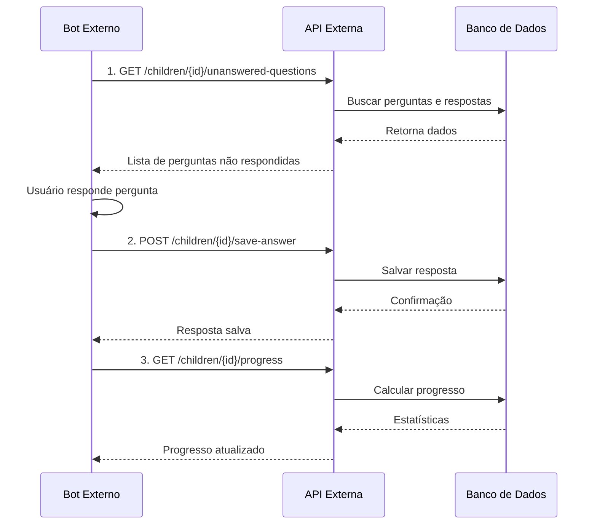

# API Externa - Endpoints de Jornada e Quiz

**Data:** 09/10/2025  
**Versão:** 1.0  
**Objetivo:** Integração externa para coletar perguntas não respondidas e salvar respostas

---

## 📋 Índice

1. [Visão Geral](#visão-geral)
2. [Autenticação](#autenticação)
3. [Endpoints](#endpoints)
   - [Buscar Perguntas Não Respondidas](#1-buscar-perguntas-não-respondidas)
   - [Salvar Resposta](#2-salvar-resposta)
   - [Buscar Progresso](#3-buscar-progresso)
4. [Exemplos de Uso](#exemplos-de-uso)
5. [Casos de Uso](#casos-de-uso)
6. [Códigos de Resposta](#códigos-de-resposta)

---

## 🎯 Visão Geral

Esta API permite que ferramentas externas (WhatsApp Bot, Telegram, SMS, etc.) interajam com a jornada do TitiNauta, coletando perguntas não respondidas e salvando as respostas dos usuários.

### Fluxo de Integração



---

## 🔐 Autenticação

Todos os endpoints requerem autenticação via **API Key**.

### Header Obrigatório
```http
X-API-Key: educare_external_api_key_2025
```

### Configuração
A API Key está definida no arquivo `.env`:
```env
EXTERNAL_API_KEY=educare_external_api_key_2025
```

---

## 📡 Endpoints

### 1. Buscar Perguntas Não Respondidas

**Endpoint:** `GET /api/external/children/{childId}/unanswered-questions`

**Descrição:** Retorna todas as perguntas da jornada que ainda não foram respondidas pela criança, baseado na idade atual.

#### Parâmetros

| Parâmetro | Tipo | Local | Obrigatório | Descrição |
|-----------|------|-------|-------------|-----------|
| `childId` | UUID | Path | Sim | ID da criança |
| `api_key` | String | Query | Sim | Chave de API |

#### Exemplo de Requisição

```bash
curl -X GET "https://api.educare.whatscall.com.br/api/external/children/a1b2c3d4-e5f6-7890-abcd-ef1234567890/unanswered-questions" \
  -H "X-API-Key: educare_external_api_key_2025"
```

#### Exemplo de Resposta (200 OK)

```json
{
  "success": true,
  "data": {
    "child": {
      "id": "a1b2c3d4-e5f6-7890-abcd-ef1234567890",
      "name": "Maria Silva",
      "age_months": 3
    },
    "total_questions": 45,
    "answered_questions": 12,
    "unanswered_questions": 33,
    "questions": [
      {
        "id": "q1-sono-seguro",
        "question_text": "O bebê dorme de barriga para cima?",
        "domain": "Sono Seguro",
        "importance": "O sono seguro é fundamental para prevenir a síndrome da morte súbita infantil.",
        "activities": "- Coloque o bebê de barriga para cima\n- Use colchão firme\n- Evite travesseiros e cobertores fofos",
        "week": 1,
        "week_title": "Semana 1 - A Chegada",
        "week_description": "Cuidados vitais para os primeiros dias",
        "age_range": {
          "min_months": 0,
          "max_months": 6
        },
        "feedback_options": {
          "positive": "Ótimo! Você está seguindo as recomendações de sono seguro.",
          "neutral": "Considere ajustar a posição do bebê para dormir.",
          "negative": "ALERTA: É muito importante que o bebê durma de barriga para cima."
        },
        "alert": "Bebês que não dormem de barriga para cima têm maior risco de morte súbita."
      },
      {
        "id": "q2-amamentacao",
        "question_text": "A pega do bebê está correta durante a amamentação?",
        "domain": "Amamentação",
        "importance": "A pega correta é essencial para uma amamentação sem dor e com boa transferência de leite.",
        "activities": "- Posição barriga com barriga\n- Boca bem aberta\n- Lábios virados para fora",
        "week": 1,
        "week_title": "Semana 1 - A Chegada",
        "week_description": "Cuidados vitais para os primeiros dias",
        "age_range": {
          "min_months": 0,
          "max_months": 12
        },
        "feedback_options": {
          "positive": "Excelente! A pega correta garante uma amamentação tranquila.",
          "neutral": "Tente ajustar a posição para melhorar a pega.",
          "negative": "ALERTA: Procure ajuda de um profissional para corrigir a pega."
        },
        "alert": "Pega incorreta pode causar dor, fissuras e baixa produção de leite."
      }
    ]
  }
}
```

#### Possíveis Erros

**404 Not Found - Criança não encontrada**
```json
{
  "success": false,
  "error": "Criança não encontrada"
}
```

---

### 2. Salvar Resposta

**Endpoint:** `POST /api/external/children/{childId}/save-answer`

**Descrição:** Salva a resposta de uma pergunta da jornada.

#### Parâmetros

| Parâmetro | Tipo | Local | Obrigatório | Descrição |
|-----------|------|-------|-------------|-----------|
| `childId` | UUID | Path | Sim | ID da criança |
| `api_key` | String | Query | Sim | Chave de API |

#### Body da Requisição

```json
{
  "question_id": "q1-sono-seguro",
  "answer": 2,
  "answer_text": "Sim, sempre",
  "metadata": {
    "source": "whatsapp",
    "timestamp": "2025-10-09T21:00:00Z"
  }
}
```

**Campos:**
- `question_id` (string, obrigatório) - ID da pergunta
- `answer` (integer, obrigatório) - Resposta numérica:
  - `0` = Negativo (Não)
  - `1` = Neutro (Às vezes)
  - `2` = Positivo (Sim)
- `answer_text` (string, obrigatório) - Texto da resposta
- `metadata` (object, opcional) - Metadados adicionais

#### Exemplo de Requisição

```bash
curl -X POST "https://api.educare.whatscall.com.br/api/external/children/a1b2c3d4-e5f6-7890-abcd-ef1234567890/save-answer" \
  -H "Content-Type: application/json" \
  -H "X-API-Key: educare_external_api_key_2025" \
  -d '{
    "question_id": "q1-sono-seguro",
    "answer": 2,
    "answer_text": "Sim, sempre coloco de barriga para cima"
  }'
```

#### Exemplo de Resposta (201 Created)

```json
{
  "success": true,
  "data": {
    "id": "r1-response-uuid",
    "child_id": "a1b2c3d4-e5f6-7890-abcd-ef1234567890",
    "question_id": "q1-sono-seguro",
    "answer": 2,
    "answer_text": "Sim, sempre coloco de barriga para cima",
    "responded_at": "2025-10-09T21:00:00.000Z",
    "created_at": "2025-10-09T21:00:00.000Z",
    "updated_at": "2025-10-09T21:00:00.000Z"
  },
  "message": "Resposta salva com sucesso"
}
```

#### Possíveis Erros

**400 Bad Request - Campos obrigatórios faltando**
```json
{
  "success": false,
  "error": "Campos obrigatórios: question_id, answer, answer_text"
}
```

**404 Not Found - Criança não encontrada**
```json
{
  "success": false,
  "error": "Criança não encontrada"
}
```

---

### 3. Buscar Progresso

**Endpoint:** `GET /api/external/children/{childId}/progress`

**Descrição:** Retorna o progresso da jornada da criança, incluindo total de perguntas, respondidas e porcentagem de conclusão.

#### Parâmetros

| Parâmetro | Tipo | Local | Obrigatório | Descrição |
|-----------|------|-------|-------------|-----------|
| `childId` | UUID | Path | Sim | ID da criança |
| `api_key` | String | Query | Sim | Chave de API |

#### Exemplo de Requisição

```bash
curl -X GET "https://api.educare.whatscall.com.br/api/external/children/a1b2c3d4-e5f6-7890-abcd-ef1234567890/progress" \
  -H "X-API-Key: educare_external_api_key_2025"
```

#### Exemplo de Resposta (200 OK)

```json
{
  "success": true,
  "data": {
    "child": {
      "id": "a1b2c3d4-e5f6-7890-abcd-ef1234567890",
      "name": "Maria Silva",
      "age_months": 3
    },
    "progress": {
      "total_questions": 45,
      "answered_questions": 12,
      "unanswered_questions": 33,
      "progress_percentage": 27,
      "status": "in_progress"
    },
    "session": {
      "id": "session-uuid",
      "status": "active",
      "started_at": "2025-10-01T10:00:00.000Z",
      "completed_at": null
    }
  }
}
```

**Status possíveis:**
- `in_progress` - Jornada em andamento
- `completed` - Jornada completa (100%)

---

## 💡 Exemplos de Uso

### Caso 1: Bot do WhatsApp

```javascript
// 1. Buscar perguntas não respondidas
const response = await fetch(
  `https://api.educare.whatscall.com.br/api/external/children/${childId}/unanswered-questions`,
  {
    headers: {
      'X-API-Key': 'educare_external_api_key_2025'
    }
  }
);

const { data } = await response.json();

// 2. Enviar primeira pergunta não respondida
const firstQuestion = data.questions[0];
await sendWhatsAppMessage(userPhone, {
  text: `📋 ${firstQuestion.domain}\n\n${firstQuestion.question_text}\n\nResponda:\n1️⃣ Não\n2️⃣ Às vezes\n3️⃣ Sim`
});

// 3. Receber resposta do usuário
onWhatsAppMessage(async (message) => {
  const answerMap = { '1': 0, '2': 1, '3': 2 };
  const answerTextMap = { '1': 'Não', '2': 'Às vezes', '3': 'Sim' };
  
  // Salvar resposta
  await fetch(
    `https://api.educare.whatscall.com.br/api/external/children/${childId}/save-answer`,
    {
      method: 'POST',
      headers: {
        'Content-Type': 'application/json',
        'X-API-Key': 'educare_external_api_key_2025'
      },
      body: JSON.stringify({
        question_id: firstQuestion.id,
        answer: answerMap[message.text],
        answer_text: answerTextMap[message.text],
        metadata: {
          source: 'whatsapp',
          phone: userPhone
        }
      })
    }
  );
  
  // Enviar feedback
  const feedback = firstQuestion.feedback_options[
    answerMap[message.text] === 2 ? 'positive' : 
    answerMap[message.text] === 1 ? 'neutral' : 'negative'
  ];
  
  await sendWhatsAppMessage(userPhone, { text: feedback });
  
  // Mostrar progresso
  const progressResponse = await fetch(
    `https://api.educare.whatscall.com.br/api/external/children/${childId}/progress`,
    {
      headers: {
        'X-API-Key': 'educare_external_api_key_2025'
      }
    }
  );
  
  const { data: progressData } = await progressResponse.json();
  await sendWhatsAppMessage(userPhone, {
    text: `✅ Progresso: ${progressData.progress.progress_percentage}%\n${progressData.progress.answered_questions}/${progressData.progress.total_questions} perguntas respondidas`
  });
});
```

### Caso 2: Bot do Telegram

```python
import requests

API_BASE = "https://api.educare.whatscall.com.br/api/external"
API_KEY = "educare_external_api_key_2025"
HEADERS = {"X-API-Key": API_KEY}

def get_unanswered_questions(child_id):
    response = requests.get(
        f"{API_BASE}/children/{child_id}/unanswered-questions",
        headers=HEADERS
    )
    return response.json()

def save_answer(child_id, question_id, answer, answer_text):
    response = requests.post(
        f"{API_BASE}/children/{child_id}/save-answer",
        headers={**HEADERS, "Content-Type": "application/json"},
        json={
            "question_id": question_id,
            "answer": answer,
            "answer_text": answer_text,
            "metadata": {"source": "telegram"}
        }
    )
    return response.json()

def get_progress(child_id):
    response = requests.get(
        f"{API_BASE}/children/{child_id}/progress",
        headers=HEADERS
    )
    return response.json()

# Uso no bot
@bot.message_handler(commands=['jornada'])
def start_journey(message):
    child_id = get_child_id_from_user(message.from_user.id)
    data = get_unanswered_questions(child_id)
    
    if data['data']['unanswered_questions'] == 0:
        bot.reply_to(message, "🎉 Parabéns! Você completou todas as perguntas!")
        return
    
    question = data['data']['questions'][0]
    markup = types.ReplyKeyboardMarkup(row_width=3)
    markup.add('❌ Não', '⚠️ Às vezes', '✅ Sim')
    
    bot.send_message(
        message.chat.id,
        f"📋 {question['domain']}\n\n{question['question_text']}",
        reply_markup=markup
    )
    
    # Salvar contexto da pergunta
    save_question_context(message.from_user.id, question['id'])

@bot.message_handler(func=lambda m: m.text in ['❌ Não', '⚠️ Às vezes', '✅ Sim'])
def handle_answer(message):
    child_id = get_child_id_from_user(message.from_user.id)
    question_id = get_question_context(message.from_user.id)
    
    answer_map = {'❌ Não': 0, '⚠️ Às vezes': 1, '✅ Sim': 2}
    answer = answer_map[message.text]
    
    # Salvar resposta
    result = save_answer(child_id, question_id, answer, message.text)
    
    # Mostrar progresso
    progress = get_progress(child_id)
    bot.reply_to(
        message,
        f"✅ Resposta salva!\n\n📊 Progresso: {progress['data']['progress']['progress_percentage']}%"
    )
```

---

## 🎯 Casos de Uso

### 1. **Bot do WhatsApp para Acompanhamento Diário**
- Enviar 1-3 perguntas por dia
- Coletar respostas via mensagens
- Fornecer feedback imediato
- Mostrar progresso semanal

### 2. **Sistema de SMS para Lembretes**
- Enviar pergunta via SMS
- Receber resposta por SMS
- Salvar automaticamente
- Enviar resumo mensal

### 3. **Integração com CRM**
- Buscar perguntas pendentes
- Exibir no painel do agente
- Salvar respostas coletadas por telefone
- Gerar relatórios de progresso

### 4. **App Mobile de Terceiros**
- Sincronizar perguntas
- Modo offline
- Salvar respostas em lote
- Atualizar progresso

### 5. **Assistente de Voz (Alexa/Google)**
- Ler pergunta em voz alta
- Capturar resposta por voz
- Salvar automaticamente
- Confirmar com feedback

---

## 📊 Códigos de Resposta

| Código | Descrição |
|--------|-----------|
| 200 | Sucesso (GET) |
| 201 | Criado com sucesso (POST) |
| 400 | Dados inválidos |
| 401 | API Key inválida |
| 404 | Recurso não encontrado |
| 500 | Erro interno do servidor |

---

## 🔄 Fluxo Completo de Integração

```
1. Identificar Criança
   ↓
2. GET /children/{id}/unanswered-questions
   ↓
3. Apresentar Pergunta ao Usuário
   ↓
4. Capturar Resposta
   ↓
5. POST /children/{id}/save-answer
   ↓
6. GET /children/{id}/progress
   ↓
7. Mostrar Feedback e Progresso
   ↓
8. Repetir do passo 2 (próxima pergunta)
```

---

## 📝 Notas Importantes

1. **Perguntas Baseadas na Idade**
   - As perguntas retornadas são filtradas pela idade da criança
   - Perguntas fora da faixa etária não aparecem

2. **Respostas Duplicadas**
   - Se uma resposta já existe, ela é atualizada
   - Não cria duplicatas

3. **Sessões Automáticas**
   - Se houver uma sessão ativa, ela é atualizada automaticamente
   - Progresso é calculado em tempo real

4. **Feedback Contextual**
   - Use `feedback_options` para dar feedback apropriado
   - Alertas importantes em `alert`

5. **Metadados**
   - Use `metadata` para rastrear origem das respostas
   - Útil para analytics e debugging

---

**Desenvolvedor:** Cascade AI  
**Última Atualização:** 09/10/2025  
**Status:** ✅ Implementado e Pronto para Uso
